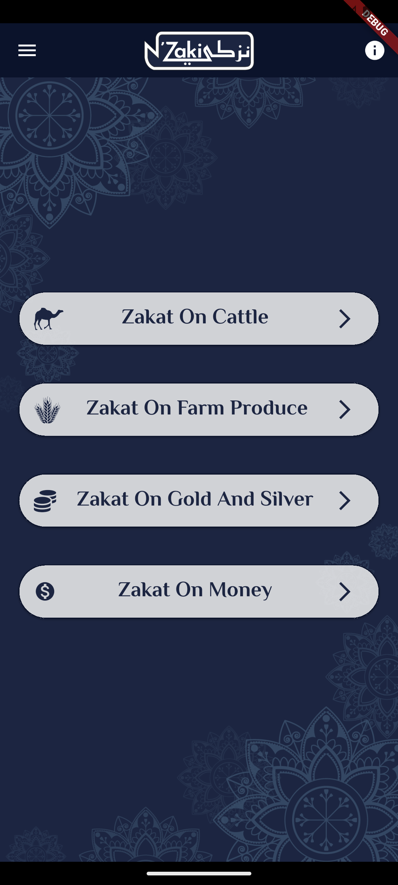
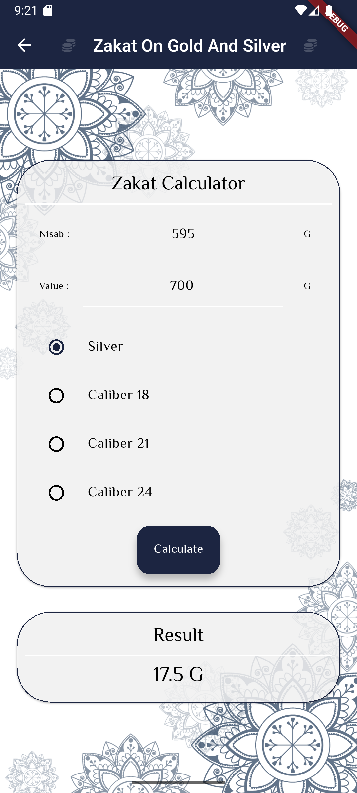
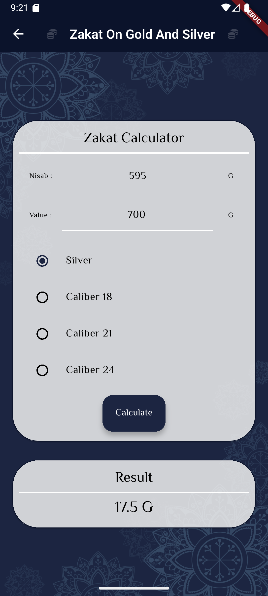
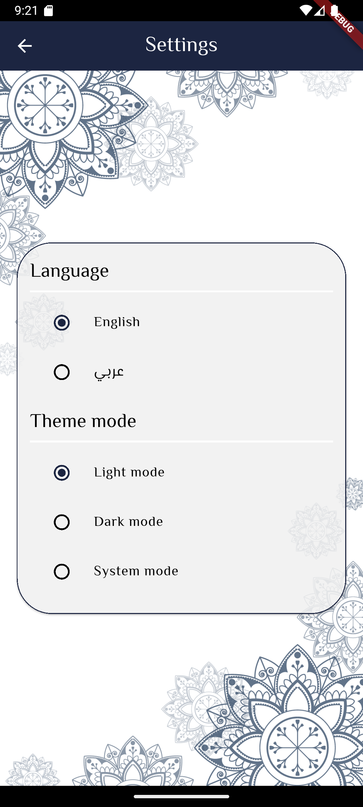
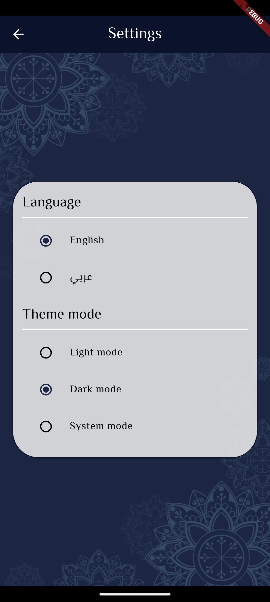

# Nzaki App

##### A Zakat Calculation App built with Flutter.

This application was developed as a second-year university project. It is designed to help Muslims calculate and manage their Zakat, a religious obligation in Islam, with a clean and user-friendly interface.

## Screenshots

| Screen | Light Mode ️ | Dark Mode  |
|:---:|:---:|:---:|
| **Home** |  |  |
| **Calculation** |  |  |
| **Settings** |  |  |


## Features

- **Zakat Calculator:** Calculate Zakat based on different asset types (Cattle, Farm Produce, Gold/Silver, Money).
- **Educational Resources:** Information and Quranic Ayats about Zakat.
- **Multi-language Support:** Fully supports **English** and **Arabic**.
- **Theme Support:** Supports **Dark Mode**, **Light Mode**, and System Default.

## Getting Started

To get started with this application, you will need the following software installed on your machine:

- [Flutter SDK](https://docs.flutter.dev/get-started/install)
- Android Studio or VSCode

## Installation

1.  **Clone the repository:**
    ```sh
    git clone https://github.com/albertoodev/nzaki-app.git
    ```
    *(Or download the ZIP file)*

2.  **Open the project** in Android Studio or VSCode.

3.  **Install dependencies:**
    ```sh
    flutter pub get
    ```

## Usage

To run the application on a connected device or emulator:
```sh
flutter run
```

## Contributing
Contributions are welcome! Please submit any bug reports, feature requests, or pull requests through the Github repository.